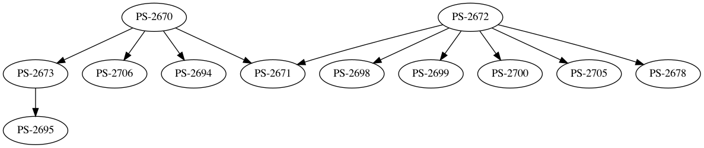

# jira-dependencies

JIRA allows you to mark a task as blocking another task, thus resulting in a
graph of dependencies. Unfortunately, that information is mostly useless,
because JIRA isn't able to display that graph visually, and none of the plugins
I've tried are doing a good job at it either.

## Installation

Install [stack](https://docs.haskellstack.org/en/stable/README/) first. It will
install ghc (that could take a while) and this Haskell program (that should be
must faster) on first use, and later uses will be much faster.

## Usage

This isn't a JIRA plugin, but a command-line tool, so you'll have to do a bit of
manual work in order to export the data from JIRA first.

1.  Search for a set of issues you're interested in, e.g. `"Epic Link" = PS-12988`
2.  Click `Export` / `CSV (All Fields)` / `Comma (,)` to download a `.csv` file.
3.  Run `jira-dependencies` on that file:

    stack run jira-dependencies example-input.csv | dot -Tpng > example-output.png

The output should look like this (but with the issue Summary if you included it
in the `.csv`):

